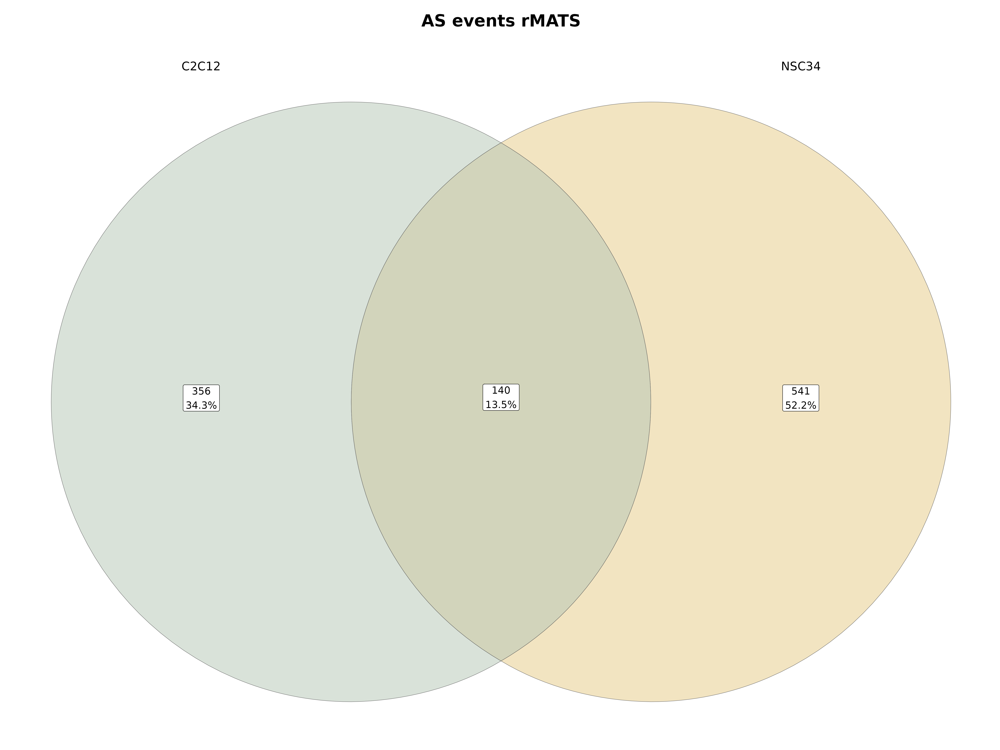

# Depo Summary 

This is still a work in progress.

This repository contains the code and results of my reanalysis of the RNA-seq data from the paper “Cell environment shapes TDP-43 function with implications in neuronal and muscle disease” by Šušnjar et al. (2022). The paper investigated the role of TDP-43, a RNA-binding protein involved in various aspects of mRNA metabolism, in mouse muscle (C2C12) and neuronal (NSC34) cells. The authors identified different sets of transcripts and splicing events that are regulated by TDP-43 in each cell type, and showed that some of them are also altered in human tissues of patients with neurodegenerative and myodegenerative diseases.

I reprocessed the raw sequencing data from scratch using Snakemake, a workflow management system that allows for reproducible and scalable data analysis. Snakemake enables the definition of analysis steps as rules that can be executed in parallel and automatically handles the dependencies between them. Snakemake also tracks the changes in the input and output files, and only reruns the necessary rules when something is modified.

The main steps of my analysis pipeline are:

Quality control and trimming of the reads using fastp and multiqc.
Alignment of the reads to the mouse reference genome (GRCm38) using hisat2, a fast and memory-efficient aligner that can handle spliced alignments.
Quantification of gene expression and detection of alternative splicing events using rMATS and MAJIQ.
Differential expression and splicing analysis using DESeq2.
Functional enrichment analysis using GOseq.
I used hisat2 instead of STAR, another popular aligner for RNA-seq data, because hisat2 requires less memory and disk space, and has comparable or better accuracy and speed. This makes hisat2 more suitable for large-scale analyses or for running on machines with limited resources.

To do: Alternative splicing analysis using MAJIQ. Calculate and plot PhyloP conservation scores.

## Snakemake rule graph:

## Reproducing figures 1b and 1e
This part of my analysis seems to match the results of the original paper.

Expression levels of Tardbp in TDP-43-silenced C2C12 and NSC34 and corresponding controls assessed by RNA-seq plotted as log10-transformed FPKM values show TDP-43 was depleted (on the mRNA level) to the same extent in both cell lines.  

PCA plot visualizes distances between siLUC- and siTDP-transfected C2C12 and NSC34 cells based on FPKM of all genes obtained by RNA-seq.  

Variation in the PC2 is explained by the presence/absence of TDP-43.  

## Reproducing Figure 2
Although the absolute numbers of identified TDP-43 regulated transcripts and certain GO terms differ from those reported by the original authors, the conclusion of the paper remains the same. The differences are likely caused by the different aligning algorithms, STAR vs HISAT2. 

Venn diagram shows the number of TDP-43-regulated transcripts identified in C2C12 and NSC34 cells exclusively, along with those that are commonly regulated by TDP-43 in both cell types. Transcripts with padj < 0.05 were considered as differentially expressed irrespective of their log2fold change.  

Venn diagram shows the overlap of TDP-43-regulated DEG identified in C2C12 and NSC34 cell line, considering only transcripts expressed in both cell lines (FPKM in both cell lines > 0.5).  

Expression changes of common targets are plotted by their log2-fold change values in C2C12 and NSC34.Grey line represents y = x and the blue line represents the fitted regression.  

TDP-43-mediated expression changes in C2C12 and NSC34 represented as volcano plots. C2C12- and NSC34-specific targets are shown in red and blue, respectively, while common targets are plotted as grey dots. Vertical lines indicate fold changes of 0.7 (30% increase) and 1.3 (30% decrease). Best hits are labelled with gene names.  

Venn diagram shows the number of cell-type-specific and overlapping GO terms enriched by DEG identified in C2C12 or NSC34 cells. GO terms (category: biological process) were grouped based on their names as those implying muscle- (red) or neuron-related features (blue).  

Representative GO terms (category: biological process) commonly enriched by DEG in C2C12 and NSC34 cells suggesting pathological abnormalities described in neurodegenerative and myodegenerative disease. I have detected different biological pathways compared to the original study. However, they still seem relevant in terms of TDP-43 proteinopathies.

## Reproducing Figure 3a, 3b

Venn diagram shows the total number of AS events (detected by rMATS at FDR < 0.01) induced by TDP-43 depletion in C2C12 and NSC34 specifically, together with those commonly detected in both cell lines.  

Venn diagram shows the total number of AS events (detected by rMATS at FDR < 0.01) induced by TDP-43 depletion in C2C12 and NSC34 specifically, together with those commonly detected in both cell lines. Interestingly I have detected fewer mutually exclusive exons compared to the original study.

## Reproducing Figure 4

Venn diagrams show the number of alternatively spliced transcripts as detected by rMATS at FDR < 0.01 in C2C12 and NSC34 cells together with GO terms (category: biological process, padj < 0.05) enriched in AS genes detected in each cell line.  

GO terms uniquely enriched in NSC34 imply on deregulation of neuronal processes, mRNA metabolism and DNA biology in NSC34 cells.
  GO terms uniquely enriched in C2C12 suggest involvement of TDP-43-regulated AS genes in DNA-modifying processes.

## Reproducing Figure 5
 I was not able to reproduce this part of the paper. I do not see any differnece in the expression of the selected RNA-binding proteins.

Expression of 63 RBPs (plotted as log10-transformed FPKM values) in C2C12 and NSC34 cells.Grey line represents y = x.  

Venn diagram shows RBPs the expression of which changes following TDP-43 reduction. I ahve detected one more common RNA binding protein, Qki.

To do:
Alternative splicing analysis using MAJIQ.
Calculate and plot PhyloP conservation scores.
